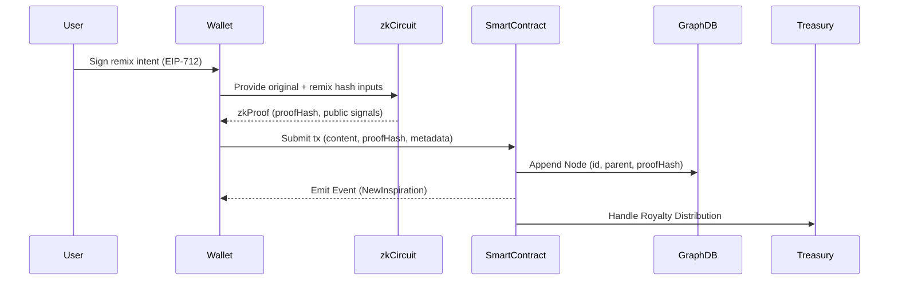

#  zkInspire — User Flow (Technical)

##  Overview

This document outlines the **step-by-step interaction** between users, cryptographic systems, and smart contracts in **zkInspire**.
It details how **Proof of Inspiration** is generated, verified, and linked to the onchain **Inspiration Graph (𝓖)**, with royalty mechanisms attached.

---

##  Actors

| Actor                 | Role                                                              |
| --------------------- | ----------------------------------------------------------------- |
| **User**              | Creator/remixer using zkInspire frontend.                         |
| **Wallet**            | Signs transactions (EIP-712) for zkProof commitment & publishing. |
| **zkCircuit**         | Generates **zkSNARK/STARK proof** for derivation authenticity.    |
| **Smart Contract**    | Verifies proofs, updates graph state, handles royalties.          |
| **Protocol Treasury** | Collects platform fees, handles referrals, distributes royalties. |

---

##  Sequence Diagram



---

## Step-by-Step User Flow

| Step | Interaction                                                      | Data Generated                                   |
| ---- | ---------------------------------------------------------------- | ------------------------------------------------ |
| 1    | **User uploads derivative work** and selects parent inspiration. | `contentHash`, `parentHash`                      |
| 2    | **zkCircuit generates zkSNARK/STARK proof** of derivation.       | `proofHash`, `publicSignals`                     |
| 3    | **User signs EIP-712 message** confirming intent + attribution.  | `signature`                                      |
| 4    | **Transaction to Smart Contract → Graph Update**                 | `{ id, creator, parent, proofHash, royalties }`  |
| 5    | **Onchain Revenue Split initiated**                              | `royaltyShareBP`, treasury allocation            |
| 6    | **Event emitted → Off-chain indexers update UI graph display.**  | `NewInspiration(contentHash, creator, depth, …)` |

---

##  Dispute & Fraud Handling Flow

| Scenario                | Protocol Behavior                                    |
| ----------------------- | ---------------------------------------------------- |
| Invalid zkProof         | `revert()` with `InvalidProof()`                     |
| Parent Inspiration Fake | Challenge opens → Dispute zkML model → Slash rewards |
| Royalty Dispute         | Resolution via onchain governance (optional)         |

---

## Royalty Distribution Flow

```plaintext
[Royalty Paid] → Split:
  - % to Original Creator(s) by depth weighting.
  - % to Current Remixer.
  - % to zkInspire Protocol Treasury.
  - % to Referrer (if applicable).
```

---
