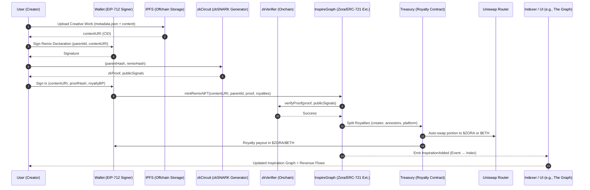

# ** Detailed User Flow (With Uniswap, Zora, IPFS)**



---

##  **Component Breakdown**

| **Layer**        | **Technology**                         | **Role**                                                 |
| ---------------- | -------------------------------------- | -------------------------------------------------------- |
| **Storage**      | IPFS                                   | Media (images/audio/video) storage; returns CID.         |
| **Proof**        | zkSNARK                         | Cryptographic proof of derivation (optional zkML later). |
| **NFT Mint**     | Zora Protocol (ERC-721 & Extensions)   | Tokenizing creative works as NFTs with inspiration link. |
| **Royalties**    | Custom contract + Zora/Uniswap         | Splitting & swapping royalties → \$ZORA, \$ETH.          |
| **Verification** | Onchain zkVerifier (Solidity Verifier) | Validating zkProof commitments on mint.                  |
| **Discovery**    | The Graph (or custom GraphQL)          | Indexing inspiration graph for search/discovery.         |

---

##  **Royalty Flow with Uniswap Integration**

1. **X% Royalty** → Sent to parent creators (based on DAG depth & declared splits).
2. **Y% Platform Fee** → Converted to \$ZORA via Uniswap.
3. **Referrer Cut (Optional)** → Routed to referrer wallet.
4. **Remaining Royalties** → Direct payout to remix creator in \$ETH or \$ZORA.

**Royalty Splitting Example:**

```plaintext
Royalty: 10%
 → 5% → Immediate parent creator
 → 2% → Ancestors (depth-based)
 → 2% → Platform (swapped to $ZORA)
 → 1% → Referrer (if any)
```

---

