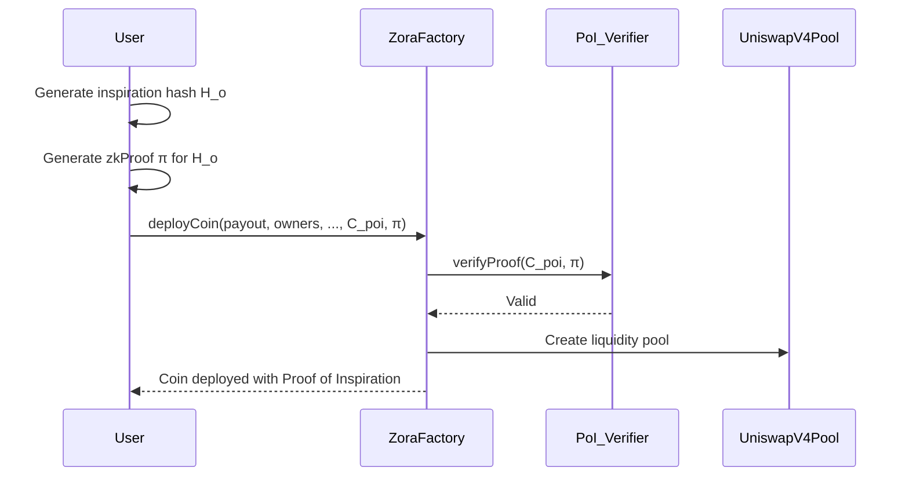

# 5. Proof of Inspiration (PoI)

## 5.1 Formal Definition

**Proof of Inspiration (PoI)** is a **zero-knowledge attestable cryptographic primitive** that enables a creator to **commit to and prove linkage between a newly minted creative asset and an existing work** without disclosing sensitive relationships. It introduces **programmable attribution guarantees** at the protocol level while preserving creator privacy.

Formally:

Given:

* Original Work Identifier: `H_o = keccak256(URI_o || metadata)`
* New Work: `W_n`
* Commitment: `C_poi = H(H_o || PK_creator || salt)`
* zk-Proof: `π ∈ ZK{ knows (H_o, salt) : C_poi = H(H_o || PK_creator || salt) }`

where:

* `PK_creator` = Creator’s onchain public key
* `H_o` = Hash of the prior work (can be IPFS CID, ENS, or NFT ID)
* `π` = Zero-knowledge proof binding the new work to the original

The **ZoraFactory deploy hook** verifies `π` to activate attribution-dependent mechanisms.

---

## 5.2 Protocol Components

### 5.2.1 Hash Commitment Scheme

* Hash Algorithm: `keccak256`
* Inputs: `(originalWorkIdentifier, creatorPublicKey, salt)`
* Purpose: **Non-malleable binding** of inspiration source to a specific creator, preventing substitution or replay attacks.

### 5.2.2 zk-SNARK Circuit

* Circuit: `PoI_Circuit`
* Inputs:

  * Public: `C_poi`
  * Private: `(H_o, salt)`
* Statement Proven:

  > *“I know an original work `H_o` such that `C_poi = H(H_o || PK_creator || salt)`”*
* zk System: Groth16 or Plonk
* Proof Size: \~200 bytes (Groth16); Verification gas: \~200k–400k depending on optimization

### 5.2.3 Onchain Verifier Contract

* Verifies proof validity.
* Emits `InspirationLinked(original, derived, commitment)` event for graph construction.
* Interfaces with the **PostDeployHook** on `ZoraFactory` to activate downstream effects.

---

## 5.3 Execution Flow

---

## 5.4 Economic Integration

* **Royalty Splits**: `PoI_RoyaltyRouter` enforces dynamic `x%` streaming to `originalWorkOwner` on every trade.
* **Inspiration Weighting**: `w_i ∈ [0,1]` → proportional attribution weight (configurable via postDeployHookData).
* **Recursive Inspiration Graphs**: Supports **multi-hop inspiration lineage**, traceable via event logs and onchain graph indexers.

---

## 5.5 Security Properties

| Property             | Guarantee                                      |
| -------------------- | ---------------------------------------------- |
| Non-Repudiation      | Binding commitment to creator key              |
| Privacy Preservation | No disclosure of original work unless opted in |
| Resistance to Sybil  | Verified with onchain PK + deterministic salt  |
| Replay Protection    | Unique commitment per work                     |

---

## 5.6 Potential Attacks & Mitigations

| Attack Type           | Mitigation                                 |
| --------------------- | ------------------------------------------ |
| **Fake Inspiration**  | Requires valid zk-Proof over actual `H_o`  |
| **False Attribution** | No PoI → No enforced revenue sharing       |
| **Denial of Service** | zk verifier optimized for low onchain cost |

---

## 5.7 Future Extensions

* **Threshold PoI**: zk-aggregated proofs for **multi-inspiration** works.
* **Encrypted Inspirations**: Homomorphic commitments for privacy-preserving discovery.
* **Integration with Zora Rewards SDK**: Enhanced for social graph-based reputation rewards.

