# zkInspire: Sponsor Technology Integration


For code integration please visit Architecture directory


---

#  Zora Protocol Integration

## Why Zora?

Zora Protocol represents the gold standard for creator-centric blockchain infrastructure. Our integration with Zora enables seamless NFT creation, distribution, and monetization while maintaining creator sovereignty and fair value distribution.

## Core Zora Features We Leverage

### 1. **Zora Factory for Dynamic NFT Creation**
- **Seamless Minting**: Creators can mint their works as NFTs directly through our interface
- **Custom Metadata**: Each NFT includes rich inspiration metadata and provenance tracking
- **Creator Ownership**: Full creator control over their intellectual property
- **Flexible Pricing**: Support for various pricing models and auction mechanisms

### 2. **Zora's Creator Economy Infrastructure**
- **Built-in Royalties**: Native support for ongoing creator compensation
- **Marketplace Integration**: Automatic listing and discovery across Zora's ecosystem
- **Community Building**: Tools for creators to build and engage their audiences
- **Cross-Platform Compatibility**: Works across all major NFT marketplaces

### 3. **Extended Royalty Framework**


## Revolutionary Inspiration Tracking

### **Multi-Level Attribution System**
- **Parent-Child Relationships**: Every derivative work maintains cryptographic links to its inspirations
- **Inspiration Depth Tracking**: System tracks how many degrees of separation exist between works
- **Automatic Revenue Distribution**: Smart contracts automatically distribute earnings up the inspiration chain

### **Creative Lineage Visualization**
- **Inspiration Graph**: Visual representation of how ideas flow and evolve
- **Impact Metrics**: Track which original works inspire the most derivatives
- **Creator Reputation**: Build reputation based on inspirational impact and creative output

---

#  Uniswap V4 Integration

## Next-Generation DeFi Infrastructure

Our protocol leverages Uniswap V4's revolutionary hook-based architecture and singleton design to create unprecedented economic mechanisms around creative inspiration, offering enhanced customization and gas efficiency.

## Core Uniswap V4 Features We Utilize

### 1. **Custom Hooks for Creator Economy**
- **Inspiration Hooks**: Custom logic triggered on every swap involving creator tokens
- **Royalty Distribution Hooks**: Automatic revenue sharing executed within swap transactions
- **Dynamic Fee Hooks**: Fees that adjust based on inspiration depth and creator reputation
- **Cross-Pool Arbitrage Hooks**: Optimize pricing across multiple creator token pools

### 2. **Singleton Architecture Benefits**

```mermaid
sequenceDiagram
    participant Creator as Creator
    participant Hook as Custom Hook
    participant Singleton as V4 Singleton
    participant Treasury as Treasury Contract
    participant Buyer as NFT Buyer
    
    Buyer->>Treasury: Purchase Derivative NFT
    Treasury->>Singleton: Swap ETH → ZORA via Hook
    Hook->>Hook: Execute Inspiration Logic
    Hook->>Creator: Distribute Royalties
    Hook->>Singleton: Complete Swap
    Singleton-->>Treasury: Return Tokens
```


### 3. **Advanced Pool Customization**
- **Creator-Specific Pools**: Each creator can have customized pool behavior via hooks
- **Inspiration-Weighted Fees**: Trading fees proportional to creative influence metrics
- **Dynamic Liquidity Management**: Hooks that adjust liquidity based on derivative creation activity
- **Cross-Token Routing**: Efficient multi-hop swaps across creator token ecosystems

## Revolutionary V4 Innovations for Creators

### **Hook-Powered Inspiration Economics**
1. **beforeSwap Hook**: Validate inspiration claims before any token exchange
2. **afterSwap Hook**: Trigger automatic royalty distribution to inspiration chain
3. **beforeAddLiquidity Hook**: Reward creators for providing liquidity with bonus tokens
4. **afterRemoveLiquidity Hook**: Handle complex withdrawal scenarios with multi-level attribution

### **Gas-Optimized Creator Operations**
- **Singleton Efficiency**: All pools share the same contract, reducing deployment costs by 99%
- **Flash Accounting**: Settlement only at transaction end, enabling complex multi-step operations
- **Batch Operations**: Multiple creator token operations in single transaction
- **Hook Composability**: Combine multiple creator economy features in single swap

---

#  Advanced V4 Hook Implementations

## Custom Creator Economy Hooks

### **InspirationDistributionHook**
```solidity
contract InspirationDistributionHook {
    function afterSwap(
        PoolKey memory key,
        IPoolManager.SwapParams memory params,
        BalanceDelta delta
    ) external returns (bytes4) {
        // Calculate inspiration royalties
        uint256 royaltyAmount = calculateInspirationRoyalties(delta);
        
        // Distribute to inspiration chain
        distributeToInspirationTree(key.currency0, royaltyAmount);
        
        return BaseHook.afterSwap.selector;
    }
}
```

### **DynamicCreatorFeeHook**
- **Reputation-Based Fees**: Lower fees for high-reputation creators
- **Volume Incentives**: Decreasing fees with increased trading volume  
- **Inspiration Bonuses**: Fee rebates for works that inspire many derivatives
- **Community Governance**: Hook parameters voted on by token holders

### **CrossPoolArbitrageHook**
- **Multi-Pool Optimization**: Find best prices across all creator token pools
- **Inspiration Value Transfer**: Move value efficiently between related creators
- **Liquidity Aggregation**: Access liquidity from multiple related pools simultaneously
- **MEV Protection**: Built-in protections against extractive arbitrage

## V4 Economic Models

### **Next-Generation Inspiration-to-Earning (I2E)**
1. **Hook-Triggered Creation**: NFT minting triggers pool creation with custom hooks
2. **Autonomous Distribution**: Hooks automatically handle complex royalty calculations
3. **Compound Liquidity Growth**: Each derivative adds liquidity to ancestor pools
4. **Cross-Creator Arbitrage**: Hooks enable value flow between related creator economies

### **Advanced Liquidity Mining via Hooks**
- **Inspiration Multipliers**: Higher rewards for inspiring popular derivatives
- **Cross-Pool Rewards**: Earn from multiple pools based on creative relationships
- **Dynamic APY**: Hook-calculated yields based on real-time inspiration metrics
- **Governance Integration**: Vote on hook parameters with creator tokens

---

#  Integrated User Flow

## Complete Creator Journey with V4

### **Phase 1: Content Creation & Advanced Pool Setup**
1. **IPFS Storage**: Upload creative work to decentralized storage
2. **Metadata Generation**: Automatic creation of rich metadata including inspiration claims
3. **Zora Minting**: Deploy as NFT through Zora's battle-tested infrastructure
4. **Custom Hook Deployment**: Deploy personalized hooks for creator-specific economics
5. **V4 Pool Creation**: Create highly customized pool with inspiration-aware hooks

### **Phase 2: Inspiration & Hook-Powered Derivation**
1. **Inspiration Declaration**: Creators declare which works inspired them
2. **zkSNARK Proof**: Generate cryptographic proof of creative relationship
3. **Hook Configuration**: Set up hooks to automatically handle inspiration royalties
4. **Derivative Minting**: Create new NFT with proven inspiration links and custom economics

### **Phase 3: Autonomous Monetization & Distribution**
1. **Hook-Enabled Trading**: All trades automatically trigger inspiration economics
2. **Multi-Hop Optimization**: V4's routing finds optimal paths across creator economies
3. **Automated Governance**: Hooks execute complex multi-party revenue sharing
4. **Ecosystem Growth**: Each transaction strengthens the entire inspiration network

---

# V4 Innovation Highlights

## Technical Breakthroughs

### **Hook-Based Creative Economics**
- **Programmable AMMs**: Each creator can define custom trading logic
- **Composable Inspiration**: Stack multiple hooks for complex creative relationships
- **Gas-Optimized Attribution**: Singleton architecture makes complex operations affordable
- **Upgradeable Economics**: Hooks can evolve as creator needs change

### **Cross-Protocol Value Flow with Enhanced Efficiency**
- **Zora NFTs**: Store and transfer creative ownership
- **V4 Hooks**: Execute custom creator economy logic within swaps
- **Singleton Pools**: 99% reduction in gas costs for pool operations
- **Flash Accounting**: Enable complex multi-step creator operations
- **IPFS Storage**: Decentralized, permanent creative asset storage
- **zkSNARK Proofs**: Cryptographic guarantees of creative authenticity

## Economic Innovation

### **Programmable Creator Markets**
- **Custom Market Logic**: Each creator can define unique market behavior
- **Inspiration-Aware Pricing**: Hooks that factor creative influence into pricing
- **Autonomous Value Distribution**: No manual intervention needed for royalty sharing
- **Ecosystem Network Effects**: Each new creator strengthens all related creators

---

#  Impact & Future Vision

## Transforming Creative Industries with V4

### **Music Industry Revolution**
- **Real-Time Sample Clearance**: Hooks execute sample payments within swap transactions
- **Programmable Remix Rights**: Custom hooks define terms for derivative works
- **Producer Recognition**: Sophisticated hook logic for complex attribution scenarios
- **Cross-Genre Value Flow**: V4's routing enables value transfer across musical styles

### **Visual Arts Ecosystem**  
- **Dynamic Art Pricing**: Hooks that adjust prices based on inspiration network growth
- **Collaborative Creation Economics**: Multi-creator hooks for complex collaborative works
- **Style Evolution Tracking**: Hooks that reward style innovation and influence
- **Digital Art Provenance**: Immutable, hook-enforced creative lineage

### **Content Creator Economy**
- **Viral Content Attribution**: Hooks that automatically reward viral content creators
- **Cross-Platform Value**: Hook-based economics work across all platforms
- **Influence Quantification**: Mathematical measurement of creative impact via hook metrics
- **Meme Economy**: Sophisticated attribution for iterative creative formats

## Next-Generation V4 Features

### **AI Integration via Hooks**
- **ML-Powered Hook Logic**: AI that optimizes creator economics in real-time
- **Automated Inspiration Detection**: Hooks that suggest and verify inspiration claims
- **Style Transfer Proofs**: zkML integration via custom hooks
- **Creative DNA Evolution**: Hook-tracked artistic influence propagation

### **Cross-Chain Hook Network**
- **Multi-Chain Hooks**: Inspiration tracking across all blockchain ecosystems
- **Universal Creator Liquidity**: Aggregate liquidity via cross-chain hooks
- **Interoperable Economics**: Creator economics that work across all platforms
- **Global Inspiration Graph**: Planet-scale creative attribution network

---

#  Sponsor Technology Benefits

## For Zora Protocol
- **Advanced Hook Integration**: Showcases Zora NFTs working with cutting-edge V4 hooks
- **Enhanced Creator Tools**: Demonstrates next-generation creator economy possibilities
- **Network Effects**: More sophisticated creators attracted to Zora ecosystem
- **Innovation Leadership**: Positions Zora at forefront of creator economy evolution

## For Uniswap V4
- **Hook Ecosystem Growth**: Demonstrates powerful real-world applications of hook architecture
- **Creator Economy Leadership**: Establishes V4 as the infrastructure for creator economies
- **Volume Generation**: Complex creator operations increase protocol usage significantly
- **Technical Innovation**: Pushes boundaries of what's possible with hooks and singleton design
- **Liquidity Innovation**: Creator communities bring novel liquidity patterns and behaviors

## Mutual Benefits
- **Technical Synergy**: Zora's NFT infrastructure + V4's programmable AMM capabilities
- **Ecosystem Leadership**: Both protocols become essential creator economy infrastructure
- **Innovation Catalyst**: Drives development of next-generation creator tools and economics
- **Market Dominance**: Establishes the definitive standard for decentralized creator economies

---