# ProofOfInspiration: Sponsor Technology Integration

For code integration please visit Architecture directory

## Project Overview

ProofOfInspiration is a revolutionary decentralized protocol that transforms how creative inspiration is tracked, attributed, and monetized. By leveraging cutting-edge blockchain infrastructure from **Zora Protocol** and **Uniswap**, we create a transparent ecosystem where creators can build upon each other's work while ensuring fair compensation flows through the entire inspiration chain.

---

##  Zora Protocol Integration

### Why Zora?

Zora Protocol represents the gold standard for creator-centric blockchain infrastructure. Our integration with Zora enables seamless NFT creation, distribution, and monetization while maintaining creator sovereignty and fair value distribution.

### Core Zora Features We Leverage

#### 1. **Zora Factory for Dynamic NFT Creation**
- **Seamless Minting**: Creators can mint their works as NFTs directly through our interface
- **Custom Metadata**: Each NFT includes rich inspiration metadata and provenance tracking
- **Creator Ownership**: Full creator control over their intellectual property
- **Flexible Pricing**: Support for various pricing models and auction mechanisms

#### 2. **Zora's Creator Economy Infrastructure**
- **Built-in Royalties**: Native support for ongoing creator compensation
- **Marketplace Integration**: Automatic listing and discovery across Zora's ecosystem
- **Community Building**: Tools for creators to build and engage their audiences
- **Cross-Platform Compatibility**: Works across all major NFT marketplaces

#### 3. **Extended Royalty Framework**

### Revolutionary Inspiration Tracking

#### **Multi-Level Attribution System**
- **Parent-Child Relationships**: Every derivative work maintains cryptographic links to its inspirations
- **Inspiration Depth Tracking**: System tracks how many degrees of separation exist between works
- **Automatic Revenue Distribution**: Smart contracts automatically distribute earnings up the inspiration chain

#### **Creative Lineage Visualization**
- **Inspiration Graph**: Visual representation of how ideas flow and evolve
- **Impact Metrics**: Track which original works inspire the most derivatives
- **Creator Reputation**: Build reputation based on inspirational impact and creative output

---

##  Uniswap V3 Integration

### Advanced DeFi Infrastructure

Our protocol leverages Uniswap V3's cutting-edge automated market maker (AMM) technology to create sophisticated economic mechanisms around creative inspiration.

### Core Uniswap Features We Utilize

#### 1. **Automated Token Swapping for Royalty Distribution**
- **Multi-Token Support**: Convert royalties between ETH, ZORA, and other tokens automatically
- **Optimal Price Discovery**: Leverage Uniswap's deep liquidity for best swap rates
- **Minimal Slippage**: V3's concentrated liquidity ensures efficient trades
- **Gas Optimization**: Batch operations to minimize transaction costs

#### 2. **Creator Token Liquidity Pools**

```mermaid
sequenceDiagram
    participant Creator as Creator
    participant Pool as Uniswap V3 Pool
    participant Treasury as Treasury Contract
    participant Buyer as NFT Buyer
    
    Buyer->>Treasury: Purchase Derivative NFT
    Treasury->>Pool: Swap ETH → ZORA (Platform Fee)
    Treasury->>Creator: Direct ETH (Creator Share)
    Treasury->>Pool: Add Liquidity (Creator Token/ETH)
    Pool-->>Creator: LP Tokens + Trading Fees
```

#### 3. **Dynamic Pricing Mechanisms**
- **Bonding Curves**: Creator token prices increase with inspiration success
- **Liquidity Incentives**: Creators earn trading fees by providing liquidity
- **Price Discovery**: Market-driven valuation of creative influence

### Advanced Economic Models

#### **Inspiration-to-Earning (I2E) System**
1. **Base Creation**: Creator mints original work, receives creator tokens
2. **Derivative Creation**: New creator builds upon original, triggering revenue share
3. **Automated Distribution**: Uniswap swaps handle multi-token payouts instantly
4. **Compound Growth**: Original creators earn from entire inspiration tree

#### **Liquidity Mining for Creators**
- **Creator Token Farms**: Stake creator tokens to earn platform rewards
- **Inspiration Rewards**: Bonus tokens for works that inspire many derivatives
- **Community Governance**: Use platform tokens to vote on protocol upgrades

---

##  Integrated User Flow

### Complete Creator Journey

#### **Phase 1: Content Creation & Upload**
1. **IPFS Storage**: Upload creative work to decentralized storage
2. **Metadata Generation**: Automatic creation of rich metadata including inspiration claims
3. **Zora Minting**: Deploy as NFT through Zora's battle-tested infrastructure
4. **Pool Creation**: Optional Uniswap V3 pool for creator token trading

#### **Phase 2: Inspiration & Derivation**
1. **Inspiration Declaration**: Creators declare which works inspired them
2. **zkSNARK Proof**: Generate cryptographic proof of creative relationship
3. **Revenue Share Setup**: Define percentage of earnings to share with inspirations
4. **Derivative Minting**: Create new NFT with proven inspiration links

#### **Phase 3: Monetization & Distribution**
1. **Sale/Auction**: List on Zora marketplace or any compatible platform
2. **Automatic Swapping**: Uniswap converts sale proceeds to preferred tokens
3. **Multi-Level Distribution**: Smart contracts distribute earnings up inspiration chain
4. **Compound Growth**: All participants benefit from ecosystem growth

---

## Innovation Highlights

### Technical Breakthroughs

#### **Zero-Knowledge Inspiration Proofs**
- **Privacy-Preserving**: Prove inspiration without revealing creative process details
- **Verifiable Claims**: Cryptographically secure attribution that can't be faked
- **Scalable Verification**: Efficient on-chain verification of complex creative relationships

#### **Cross-Protocol Value Flow**
- **Zora NFTs**: Store and transfer creative ownership
- **Uniswap Swaps**: Enable seamless value exchange across token types
- **IPFS Storage**: Decentralized, permanent creative asset storage
- **zkSNARK Proofs**: Cryptographic guarantees of creative authenticity

### Economic Innovation

#### **Sustainable Creator Economy**
- **Fair Attribution**: Mathematical guarantee that inspiration is rewarded
- **Compound Creativity**: Original creators benefit from entire inspiration tree
- **Reduced Platform Extraction**: Direct creator-to-creator value transfer
- **Market-Driven Pricing**: True price discovery through decentralized markets

---

##  Impact & Future Vision

### Transforming Creative Industries

#### **Music Industry Revolution**
- **Sample Clearance**: Automatic, transparent sample clearance and payment
- **Remix Culture**: Legal framework for remix and derivative works
- **Producer Recognition**: Beat makers and producers get ongoing royalties

#### **Visual Arts Ecosystem**  
- **Art Movement Tracking**: Follow how artistic styles and movements evolve
- **Collaborative Creation**: Multiple artists can contribute and share in success
- **Digital Art Provenance**: Immutable record of artistic influence and inspiration

#### **Content Creator Economy**
- **Meme Attribution**: Track and monetize viral content creation
- **Influence Mapping**: Quantify and reward creative influence
- **Cross-Platform Value**: Earnings follow creators across all platforms

### Next-Generation Features

#### **AI Integration**
- **Automated Inspiration Detection**: AI analysis to suggest inspiration claims
- **Style Transfer Proofs**: zkML proofs for AI-generated derivative works
- **Creative DNA**: Genetic-style tracking of artistic influence propagation

#### **Cross-Chain Expansion**
- **Multi-Chain NFTs**: Support for Ethereum, Polygon, Base, and other chains
- **Universal Liquidity**: Aggregate liquidity across all major DEXs
- **Interoperable Inspiration**: Track inspiration across blockchain ecosystems

---

##  Sponsor Technology Benefits

### For Zora Protocol
- **Expanded Use Case**: Showcases advanced creator economy applications
- **Network Effects**: More creators minting through Zora infrastructure
- **Innovation Driver**: Pushes boundaries of what's possible with creator tools
- **Ecosystem Growth**: Attracts developers building on Zora's foundation

### For Uniswap
- **Novel Trading Pairs**: Creator tokens create new trading opportunities
- **Volume Generation**: Automated swapping increases protocol usage
- **DeFi Innovation**: Demonstrates advanced use cases beyond simple token swapping
- **Liquidity Attraction**: Creator communities bring new liquidity sources

### Mutual Benefits
- **Technical Synergy**: Zora's NFT infrastructure + Uniswap's DeFi primitives
- **Ecosystem Expansion**: Both protocols benefit from increased adoption
- **Innovation Catalyst**: Pushes both platforms toward next-generation features
- **Market Leadership**: Positions both as leaders in creator economy infrastructure

---
